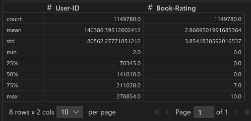
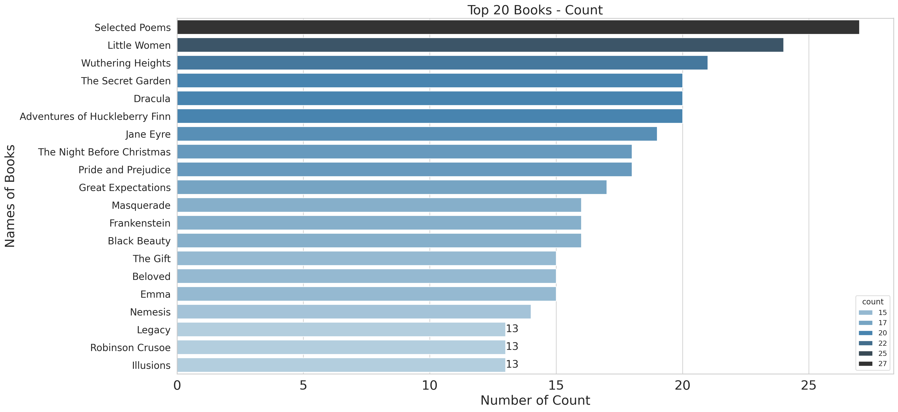
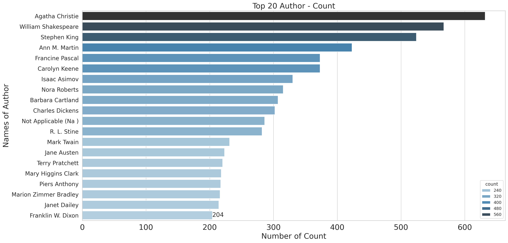
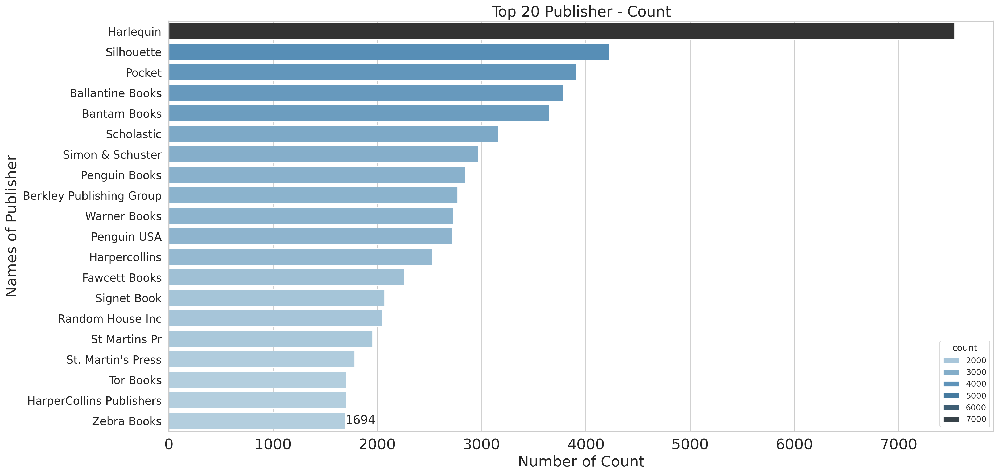
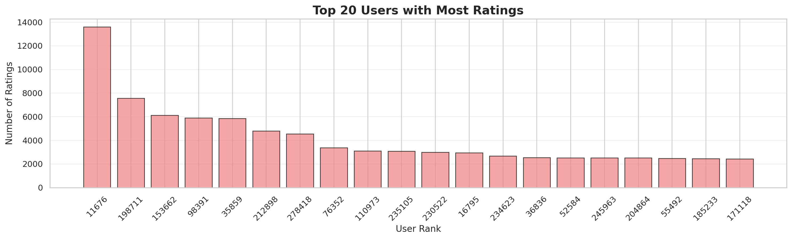
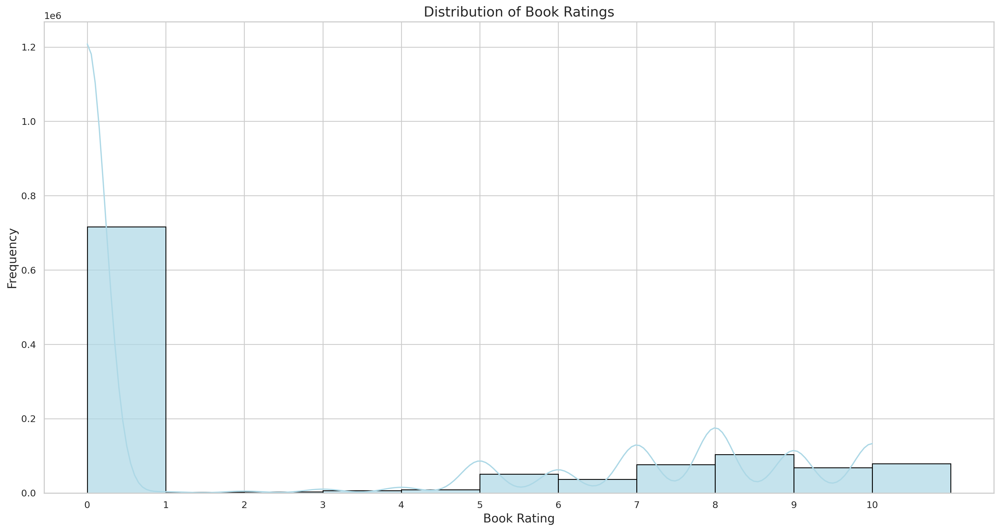
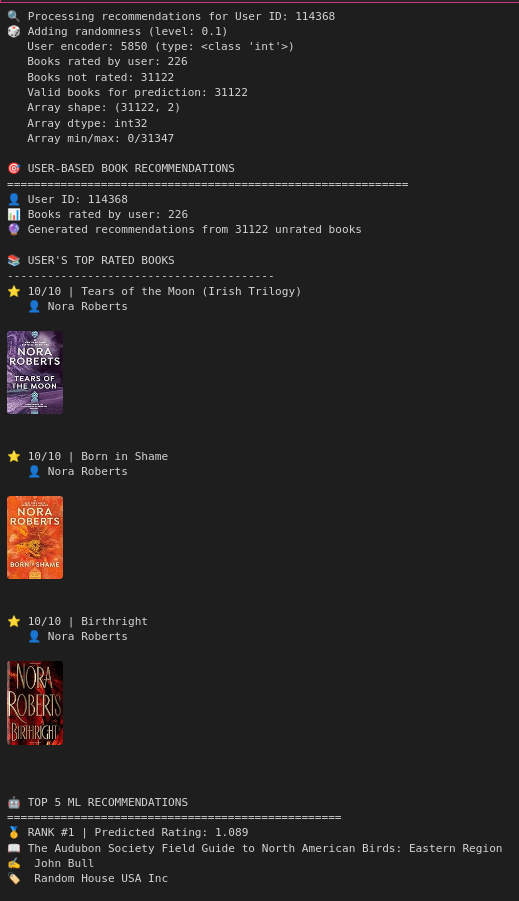
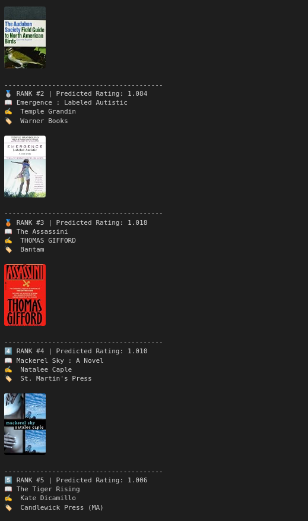
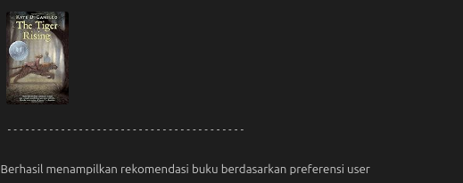
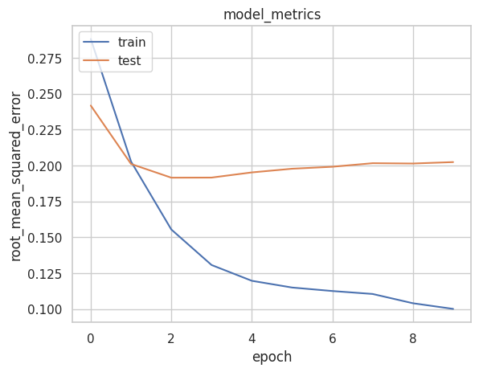

# Laporan Proyek Machine Learning - Nadia Putri Natali Lubis

- [Laporan Proyek Machine Learning - Nadia Putri Natali Lubis](#laporan-proyek-machine-learning---nadia-putri-natali-lubis)
  - [Project Overview](#project-overview)
  - [Business Understanding](#business-understanding)
    - [Problem Statements](#problem-statements)
    - [Goals](#goals)
    - [Solution Statements](#solution-statements)
  - [Data Understanding](#data-understanding)
    - [Analisis Duplikasi Data](#analisis-duplikasi-data)
    - [Analisis Missing Value](#analisis-missing-value)
    - [Univariate Exploratory Data Analysis](#univariate-exploratory-data-analysis)
      - [Books Variable](#books-variable)
      - [Ratings Variable](#ratings-variable)
      - [Users Variable](#users-variable)
    - [Exploratory Data Analysis](#exploratory-data-analysis)
      - [Top 20 Books](#top-20-books)
      - [Top 20 Authors](#top-20-authors)
      - [Top 20 Publisher](#top-20-publisher)
      - [Top 20 User](#top-20-user)
      - [Rating distribution](#rating-distribution)
  - [Data Preparation](#data-preparation)
    - [Mengatasi Missing Value](#mengatasi-missing-value)
    - [Drop rating 0](#drop-rating-0)
    - [Sampling data](#sampling-data)
    - [Menggabungkan Buku](#menggabungkan-buku)
    - [Menggabungkan Seluruh Users](#menggabungkan-seluruh-users)
    - [Menggabungkan dataframe subset\_books dan subset\_ratings](#menggabungkan-dataframe-subset_books-dan-subset_ratings)
    - [Mengurutkan dataframe berdasrkan ISBN](#mengurutkan-dataframe-berdasrkan-isbn)
    - [Menghapus duplikasi ISBN](#menghapus-duplikasi-isbn)
    - [Membuat fungsi encode dan decode](#membuat-fungsi-encode-dan-decode)
    - [Mapping hasil encoding ke dataframe](#mapping-hasil-encoding-ke-dataframe)
    - [Mendapatkan nilai minimun dan maksimum rating untuk normalisasi](#mendapatkan-nilai-minimun-dan-maksimum-rating-untuk-normalisasi)
    - [Mengacak data pada dataset](#mengacak-data-pada-dataset)
    - [Membagi Data untuk Training dan Validasi](#membagi-data-untuk-training-dan-validasi)
  - [Modeling](#modeling)
    - [Arsitektur Model](#arsitektur-model)
    - [Cara Kerja](#cara-kerja)
    - [Kelebihan Pendekatan Neural Collaborative Filtering](#kelebihan-pendekatan-neural-collaborative-filtering)
    - [Kekurangan Pendekatan Neural Collaborative Filtering](#kekurangan-pendekatan-neural-collaborative-filtering)
    - [Memberikan rekomendasi](#memberikan-rekomendasi)
  - [Evaluation](#evaluation)
    - [Metrik Evaluasi yang Digunakan Evaluating Recommender Systems](#metrik-evaluasi-yang-digunakan-evaluating-recommender-systems)
      - [Root Mean Squared Error (RMSE)](#root-mean-squared-error-rmse)
      - [Formula dan Cara Kerja RMSE](#formula-dan-cara-kerja-rmse)
      - [Karakteristik RMSE](#karakteristik-rmse)
    - [Hasil Evaluasi Model](#hasil-evaluasi-model)
      - [Analisis Kurva Training](#analisis-kurva-training)
      - [Interpretasi Hasil](#interpretasi-hasil)
    - [Dampak Model terhadap Business Understanding](#dampak-model-terhadap-business-understanding)
      - [Evaluasi Pencapaian Problem Statements](#evaluasi-pencapaian-problem-statements)
      - [Evaluasi Pencapaian Goals](#evaluasi-pencapaian-goals)
      - [Evaluasi Efektivitas Solution Statements](#evaluasi-efektivitas-solution-statements)
      - [Kesimpulan Evaluasi](#kesimpulan-evaluasi)


## Project Overview

Dikutip dari [Personalized Book Recommendation System using
Machine Learning Algorithm], "Sebagian besar organisasi memiliki sistem rekomendasi mereka ketika mereka menjual produk secara online. Namun hampir semua situs web tidak dikembangkan berdasarkan minat pembeli; organisasi memaksa penjualan tambahan kepada pembeli dengan merekomendasikan produk yang tidak perlu dan tidak relevan. Sistem rekomendasi yang dipersonalisasi (PRS) membantu pengguna individu menemukan produk yang menarik dan berguna dari koleksi item yang sangat besar. Dengan pertumbuhan internet, konsumen memiliki banyak pilihan produk dari situs e-commerce. Menemukan produk yang tepat pada waktu yang tepat merupakan tantangan nyata bagi konsumen. Sistem rekomendasi yang dipersonalisasi membantu pengguna menemukan buku, berita, film, musik, kursus online, dan artikel penelitian" (Sarma et al., 2021).

Karena banyaknya pilihan buku bagi seseorang, diperlukan adanya solusi untuk menemukan buku yang cocok dari banyaknya pilihan yang tersedia.

Salah satu solusinya adalah melalui sistem rekomendasi. Berdasarkan [Sistem Rekomendasi pada Buku dengan Menggunakan Metode Trust-Aware
Recommendation], sistem rekomendasi sendiri sangat diperlukan dikarenakan terlalu banyaknya jenis dan jumlah data yang ada. Dengan adanya sistem rekomendasi, pengguna akan dimanjakan dengan rekomendasi – rekomendasi buku yang sesuai dengan preferensi masing – masing pengguna, sehingga pengguna tidak perlu repot melakukan pencarian buku yang diinginkan. Sistem rekomendasi sendiri harus dapat menganalisis sekian banyak data tentang pengguna dan buku yang tersedia, dapat juga didukung dengan data rating agar hasil yang diberikan lebih akurat.

## Business Understanding

### Problem Statements
Berdasarkan analisis kebutuhan bisnis dan literatur yang ada, berikut adalah pernyataan masalah yang akan diselesaikan:
1. **Kesulitan Pengguna dalam Memilih Buku**
   1. Pengguna kesulitan menemukan buku yang sesuai dengan preferensi dari banyak pilihan yang tersedia
   2. Dibutuhkan sistem yang dapat memprediksi rating pengguna terhadap buku tertentu
2. **Kurangnya Personalisasi dalam Rekomendasi**
   1. Sistem rekomendasi yang ada belum mempersonalisasi rekomendasi berdasarkan preferensi individual pengguna
   2. Diperlukan model yang dapat memberikan rekomendasi berdasarkan similaritas preferensi antar pengguna

### Goals
Tujuan yang ingin dicapai untuk menyelesaikan pernyataan masalah:
1. **Membangun Model Prediksi Rating**
   1. Mengembangkan model collaborative filtering yang dapat memprediksi rating pengguna terhadap buku dengan akurat
   2. Menghasilkan model yang dapat membantu pengguna menemukan buku sesuai prediksi preferensi mereka
2. **Implementasi Sistem Rekomendasi Personal**
   1. Membangun sistem yang dapat memberikan rekomendasi buku personal untuk setiap pengguna
   2. Menghasilkan model yang dapat mempelajari pola preferensi dari data rating historis

### Solution Statements
Solusi yang akan diimplementasikan:
1. **Penggunaan Collaborative Filtering dengan Neural Network**
   1. Implementasi model Neural Collaborative Filtering (NCF) untuk memprediksi rating
   2. Model menggunakan embedding layers untuk user dan item representation
   3. Training menggunakan RMSE untuk metrik loss
   4. Implementasi EarlyStopping untuk mengatasi overfitting
2. **Evaluasi dengan Root Mean Squared Error (RMSE)**
   1. Menggunakan RMSE sebagai metrik evaluasi utama untuk mengukur akurasi prediksi rating
   2. RMSE dipilih karena memberikan penalti lebih besar pada error prediksi yang jauh dari nilai sebenarnya


## Data Understanding

Untuk dapat membangun sistem rekomendasi buku, kita memerlukan dataset terlebih dahulu. Kali ini, kita mengambil data dari [Kaggle].

Dataset yang kita miliki terdiri dari 3 file, yaitu:
- **BX_Books.csv** : Berisi informasi seputar buku yang tersedia pada dataset
- **BX-Book-Ratings.csv** : Berisi informasi seputar rating yang dilakukan user terhadap suatu buku
- **BX-Users.csv** : Berisi informasi seputar user yang tersedia pada dataset

Informasi mengenai datasetnya sendiri yaitu terdiri dari 278,858 users anonim tetapi dengan informasi demografi yang menyediakan 1,149,780 ratings (explicit / implicit) tentang 271,379 books.

**Adapun fitur-fitur yang terdapat di masing-masing file data tersebut adalah**:
- BX_Books:
  - ISBN : International Standard Book Number
  - Book-Title : Judul buku
  - Book-Author : Penulis buku
  - Year-Of-Publication : Tahun terbit
  - Publisher : Penerbit
  - Image-URL-S : Link gambar berukuran kecil
  - Image-URL-M : Link gambar berukuran sedang
  - Image-URL-L : Link gambar berukuran besar
- BX-Book-Ratings:
  - User-ID : ID user/pembaca
  - ISBN : International Standard Book Number
  - Book-Rating : Skor yang diberikan pengguna
- BX-Users
  - User-ID : ID user/pembaca
  - Location : Lokasi user
  - Age : Usia user

**Informasi setiap dataframe yang kita miliki ada pada tabel berikut:**
| Dataframe | Jumlah baris  | Jumlah kolom  |
|-----------|---------------|---------------|
| books     | 271.379       | 8             |
| ratings   | 1.149.780     | 3             |
| users     | 278.858       | 3             |


### Analisis Duplikasi Data
```sh
Jumlah buku duplikat: 0
Jumlah rating duplikat: 0
Jumlah user duplikat: 0
```
**Insight** : Dari jumlah data yang sangat besar, tidak ditemukan adanya duplikasi data.

### Analisis Missing Value
```sh
Missing values pada buku:
ISBN                   0
Book-Title             0
Book-Author            2
Year-Of-Publication    0
Publisher              2
Image-URL-S            0
Image-URL-M            0
Image-URL-L            0
dtype: int64

Missing values pada rating:
User-ID        0
ISBN           0
Book-Rating    0
dtype: int64

Missing values pada user:
User-ID          0
Location         0
Age         110762
dtype: int64
```
**Insight** : Terdapat missing value pada books df dan users df.


### Univariate Exploratory Data Analysis

#### Books Variable
```sh
<class 'pandas.core.frame.DataFrame'>
RangeIndex: 271379 entries, 0 to 271378
Data columns (total 8 columns):
 #   Column               Non-Null Count   Dtype 
---  ------               --------------   ----- 
 0   ISBN                 271379 non-null  object
 1   Book-Title           271379 non-null  object
 2   Book-Author          271377 non-null  object
 3   Year-Of-Publication  271379 non-null  int64 
 4   Publisher            271377 non-null  object
 5   Image-URL-S          271379 non-null  object
 6   Image-URL-M          271379 non-null  object
 7   Image-URL-L          271379 non-null  object
dtypes: int64(1), object(7)
memory usage: 16.6+ MB

Banyak data: 271379
Judul buku yang tersedia: ['Classical Mythology' 'Clara Callan' 'Decision in Normandy' ...
 'Lily Dale : The True Story of the Town that Talks to the Dead'
 "Republic (World's Classics)"
 "A Guided Tour of Rene Descartes' Meditations on First Philosophy with Complete Translations of the Meditations by Ronald Rubin"]
 ```
**Insight** : Dataframe subset_books terdiri dari 7 data kategorikal dan 1 data numerik.

#### Ratings Variable
```sh
<class 'pandas.core.frame.DataFrame'>
RangeIndex: 1149780 entries, 0 to 1149779
Data columns (total 3 columns):
 #   Column       Non-Null Count    Dtype 
---  ------       --------------    ----- 
 0   User-ID      1149780 non-null  int64 
 1   ISBN         1149780 non-null  object
 2   Book-Rating  1149780 non-null  int64 
dtypes: int64(2), object(1)
memory usage: 26.3+ MB

Banyak data: 1149780
Nilai rating yang ada pada dataset: [ 0  1  2  3  4  5  6  7  8  9 10]
Banyak user yang memberikan rating: 105283
```
> Dataframe subset_ratings terdiri dari 2 data numerik dan 1 data kategorikal. Rating berada pada range 0 hingga 10.



> Data pada User-ID dan Book rating memiliki jumlah yang sama yaitu 1149780. Dapat dilihat bahwa nilai Book-Rating sebagian besar merupakan nilai 0 karena data minimal hingga mediannya bernilai 0.

#### Users Variable
```sh
<class 'pandas.core.frame.DataFrame'>
RangeIndex: 278858 entries, 0 to 278857
Data columns (total 3 columns):
 #   Column    Non-Null Count   Dtype  
---  ------    --------------   -----  
 0   User-ID   278858 non-null  int64  
 1   Location  278858 non-null  object 
 2   Age       168096 non-null  float64
dtypes: float64(1), int64(1), object(1)
memory usage: 6.4+ MB

Banyak data: 278858
User yang ada pada dataset: [     1      2      3 ... 278856 278857 278858]
```
> Dataframe subset_users memiliki 2 data numerik dan 1 data kategorikal dengan jumlah 278.858 data.

### Exploratory Data Analysis
#### Top 20 Books
Dari data buku dalam dataframe, terdapat 242.154 judul buku yang unik. Namun, itu bukan berarti ada duplikasi data, karena data dengan judul tersebut dapat memiliki Author, Tahun terbit, hingga Penerbit yang berbeda.



> Judul buku "Selected Poems" memiliki jumlah terbanyak yaitu 27 buku.

#### Top 20 Authors
Dari data author yang dimiliki, ada sebanyak 102.027 data Author unik. Agatha Christie memiliki data terbanyak yaitu sebanyak 632 buku.



> Agatha Christie merupakan Author dengan karya terbanyak dalam dataset ini.

#### Top 20 Publisher
Dari data publisher yang dimiliki, ada sebanyak 16.806 data unik dari publisher.



> Harlequin merupakan penerbit dengan terbitan terbanyak, yaitu sebanyak 7.536 data.

#### Top 20 User
> User yang paling banyak memberikan rating pada dataset adalah User 11676 dengan 13.602 rating.



#### Rating distribution
> Ada banyak sekali rating yang memiliki nilai 0. Bahkan, rating pada dataset ini didominasi dengan rating 0.




## Data Preparation

### Mengatasi Missing Value

Berdasarkan analisis sebelumnya, ditemukan adanya missing value pada books dataframe dan users dataframe, pada tahap ini, kita akan handling missing value tersebut dengan metode dropna. 

```sh
Missing values pada buku:
ISBN                   0
Book-Title             0
Book-Author            0
Year-Of-Publication    0
Publisher              0
Image-URL-S            0
Image-URL-M            0
Image-URL-L            0
dtype: int64

Missing values pada user:
User-ID     0
Location    0
Age         0
dtype: int64
```
**Insight** : Berhasil mengatasi missing value.

### Drop rating 0

Tidak ada keterangan apakah nilai 0 merupakan rating murni user akan suatu buku, atau nilai 0 merupakan nilai default untuk user yang belum melakukan rating. Karena itu kita hanya memilih rating dengan nilai pada rentang 1 hingga 10.

```sh
ratings = ratings[ratings['Book-Rating'] != 0]
```

```sh
Banyak data: 433671
Nilai rating yang ada pada dataset: [ 1  2  3  4  5  6  7  8  9 10]
Banyak user yang memberikan rating: 77805
```

**Insight:** Berhasil memilih rating dengan rentang 1-10.

### Sampling data

Karena keterbatasan sumber daya, kita akan melakukan sampling terlebih dahulu untuk melakukan eksplorasi lebih lanjut. Kita akan melakukan sampling dengan menggunakan library numpy fungsi random.choice(). Ukuran sampling yang digunakan adalah 100.000 data.

```sh
sampled_books = np.random.choice(books.ISBN.unique(), size=100000, replace=False)
subset_books = books[books.ISBN.isin(sampled_books)]
```
**Insight** : Berhasil melakukan sampling dataframe books dengan 100.000 data.

```sh
sampled_users = np.random.choice(users['User-ID'].unique(), size=100000, replace=False)
subset_users = users[users['User-ID'].isin(sampled_users)]
```
**Insight** : Berhasil melakukan sampling dataframe users dengan 100.000 data.


```sh
subset_ratings = ratings[
    (ratings.ISBN.isin(sampled_books)) & 
    (ratings['User-ID'].isin(sampled_users))
].drop_duplicates(subset=['User-ID', 'ISBN'])

subset_ratings
```
**Insight** : Berhasil melakukan sampling dataframe rating yang memiliki buku dan user yang telah dilakukan sampling.

```sh
Dataset subset:
Jumlah buku: 100000
Jumlah rating: 60498
Jumlah user: 100000
```

**Insight** : Setelah sampling, data yang dimiliki adalah 100.000 jenis buku, 60.498 data rating, dan 100.000 jumlah user.


### Menggabungkan Buku

```sh
all_books = np.concatenate((
    subset_books['ISBN'].unique(),
    subset_ratings['ISBN'].unique(),
))

all_books = np.sort(np.unique(all_books))
print('Jumlah seluruh buku pada dasaset berdasarkan ISBN:', len(all_books))
```

**Insight** : Jumlah seluruh buku berdasarkan ISBN ada sebanyak 100.000 data.

**Proses** : Melakukan penggabungan data isbn pada dataframe subset_books dan subset_ratings.

**Alasan perlu dilakukan** : Untuk memastikan data ISBN yang terdapat pada subset_rating dimiliki informasinya pada dataset kita.

### Menggabungkan Seluruh Users

```sh
all_users = np.concatenate((
    subset_users['User-ID'].unique(),
    subset_ratings['User-ID'].unique(),
))

all_users = np.sort(np.unique(all_users))
print('Jumlah seluruh user pada dasaset berdasarkan User-ID:', len(all_users))
```
**Insight** : Terdapat 100.000 data user pada dataset.

**Proses** : Melakkan penggabungan data User-ID pada dataframe subset_users dan subset_ratings.

**Alasan perlu dilakukan** : Untuk memastikan kita memiliki informasi User-ID yang melakukan rating.

### Menggabungkan dataframe subset_books dan subset_ratings

```sh
book_info = pd.merge(subset_ratings, subset_books, on='ISBN', how='inner')

book_info

<class 'pandas.core.frame.DataFrame'>
RangeIndex: 60498 entries, 0 to 60497
Data columns (total 10 columns):
 #   Column               Non-Null Count  Dtype 
---  ------               --------------  ----- 
 0   User-ID              60498 non-null  int64 
 1   ISBN                 60498 non-null  object
 2   Book-Rating          60498 non-null  int64 
 3   Book-Title           60498 non-null  object
 4   Book-Author          60498 non-null  object
 5   Year-Of-Publication  60498 non-null  int64 
 6   Publisher            60498 non-null  object
 7   Image-URL-S          60498 non-null  object
 8   Image-URL-M          60498 non-null  object
 9   Image-URL-L          60498 non-null  object
dtypes: int64(3), object(7)
memory usage: 4.6+ MB
```

**Insight** : Dataframe book_info terdiri dari 3 data numerik dan 7 data kategorikal yang berisi data rating dan identitas buku.

**Proses** : Melakukan merge dataframe subset_books dan subset_ratings berdasarkan ISBN dengan metode inner untuk memastikan tidak ada data kosong.

**Alasan perlu dilakukan** : Untuk mempermudah pencarian informasi mengenai buku hasil rekomendasi nantinya.


### Mengurutkan dataframe berdasrkan ISBN
```sh
preparation = book_info
preparation.sort_values('ISBN')
```

**Insight** : ISBN yang ada pada dataframe berhasil diurutkan

**Proses** : memanggil fungsi sort_values()

**Alasan perlu dilakukan** : nantinya ISBN akan diencode sehingga proses ini akan merapikan data buku

### Menghapus duplikasi ISBN
```sh
preparation = preparation.drop_duplicates('ISBN')
preparation
```

**Insight** : Data duplikat ISBN berhasil dibersihkan

**Proses** : Memanggil fungsi drop_duplicates()

**Alasan perlu dilakukan** : ISBN merupakan International Standard Book Number yang berarti ISBN bernilai unik. Duplikasi ISBN perlu dibersihkan supaya tidak terjadi kebingungan.

### Membuat fungsi encode dan decode
```sh
# Mengubah userID menjadi list tanpa nilai yang sama
user_ids = df['User-ID'].unique().tolist()
print('list userID: ', user_ids)
    
# Melakukan encoding userID
user_to_user_encoded = {x: i for i, x in enumerate(user_ids)}
print('encoded userID : ', user_to_user_encoded)
    
# Melakukan proses encoding angka ke ke userID
user_encoded_to_user = {i: x for i, x in enumerate(user_ids)}
print('encoded angka ke userID: ', user_encoded_to_user)

# Mengubah ISBN menjadi list tanpa nilai yang sama
isbn_ids = df['ISBN'].unique().tolist()
print('list ISBN: ', isbn_ids)
    
# Melakukan proses encoding ISBN
isbn_to_isbn_encoded = {x: i for i, x in enumerate(isbn_ids)}
print('encoded ISBN : ', isbn_to_isbn_encoded)
    
# Melakukan proses encoding angka ke ISBN
isbn_encoded_to_isbn = {i: x for i, x in enumerate(isbn_ids)}
print('encoded angka ke ISBN: ', isbn_encoded_to_isbn)
```

**Insight** : Fitur User_ID dan ISBN berhasil memiliki fungsi encode dan decode

**Proses** : Pada masing-masing fitur diambil nilai uniknya terlebih dahulu, kemudian membuat dictionary yang berisi nilai asal dan hasil encoding, begotu jug auntuk proses decode

**Alasan perlu dilakukan** : Karena model tidak dapat memproses data kategorikal sehingga perlu dilakukan encoding terlebih dahulu

### Mapping hasil encoding ke dataframe
```sh
# Mapping User-ID ke dataframe user
df['user'] = df['User-ID'].map(user_to_user_encoded)
    
# Mapping ISBN ke dataframe isbn
df['isbn'] = df['ISBN'].map(isbn_to_isbn_encoded)
```

**Insight** : Berhasil melakukan encoding fitur user dan isbn

**Proses** : Mmmanggil fungsi map()

**Alasan perlu dilakukan** : Karena model tidak dapat memproses data kategorikal sehingga perlu dilakukan encoding terlebih dahulu

### Mendapatkan nilai minimun dan maksimum rating untuk normalisasi
```sh
min_rating = min(df['Book-Rating'])
    
max_rating = max(df['Book-Rating'])
    
print(' Min Rating: {}, Max Rating: {}'.format(
    min_rating, max_rating
))
```
**Insight** : Rating memiliki nilai minimum 1 dan maksimum 10

**Proses** : memanggil fungsi min() dan max()

**Alasan perlu dilakukan** : Data minimum dan maksimum akan digunakan dalam proses normalisasi untuk meningkatkan kinerja model

### Mengacak data pada dataset

```sh
# Mengacak dataset
df = df.sample(frac=1, random_state=42)
df
```
**Insight** : data pada Dataframe berhasil diacak

**Proses** : Memanggil fungsi sample()

**Alasan perlu dilakukan** : Untuk meningkatkan generalisasi, salah satunya dengan menghindari urutan bias

### Membagi Data untuk Training dan Validasi

```sh
# Membuat variabel x untuk mencocokkan data user dan resto menjadi satu value
x = df[['user', 'isbn']].values
    
# Membuat variabel y untuk membuat rating dari hasil 
y = df['Book-Rating'].apply(lambda x: (x - min_rating) / (max_rating - min_rating)).values
    
# Membagi menjadi 80% data train dan 20% data validasi
train_indices = int(0.8 * df.shape[0])
x_train, x_val, y_train, y_val = (
    x[:train_indices],
    x[train_indices:],
    y[:train_indices],
    y[train_indices:]
)
    
print(x, y)
```
**Insight** : Data berhasil dibagi menjadi data train dan validasi dengan variabel x dan y (target)

**Proses** : Pada variabel x dilakukan pengambilan values pada fitur user dan isbn, variabel y dengan fitur rating yang dilakukan proses normalisasi terlebih dahulu. setelah itu data dibagi dengan proporsi 80:20 

**Alasan perlu dilakukan** : Menentukan data training dan data validasi untuk model belajar


## Modeling

Berdasarkan [Collaborative Filtering in Machine Learning], collaborative filtering mencari pengguna yang memiliki ketertarikan yang mirip yang kemudian merekomendasikan suatu produk berdasarkan kesamaan user. Dengan metode ini, kita tidak melakukan rekomendasi berdasarkan konten produk tersebut, melainkan mengelompokkan user dengan preferensi yang sama dan memberikan rekomendasi satu sama lain.

Dalam project ini, kita menggunakan sistem Rekomendasi Collaborative Filtering dengan Neural Network.

**Penjelasan Sistem**

### Arsitektur Model
Model RecommenderNet menggunakan pendekatan Neural Collaborative Filtering yang menggabungkan:

- Embedding Layers
    - User Embedding: Merepresentasikan karakteristik setiap user dalam ruang vektor 50 dimensi
    - Book Embedding: Merepresentasikan karakteristik setiap buku dalam ruang vektor 50 dimensi
    - Bias Terms: Menangkap preferensi global user dan popularitas buku
- Dot Product Operation
    - Menghitung similarity antara user dan book vectors
    - tf.tensordot(user_vector, book_vector, 2) menghasilkan skor kompatibilitas
- Final Prediction
  - Kombinasi: dot_product + user_bias + book_bias
  - Aktivasi sigmoid untuk output probabilitas (0-1)

### Cara Kerja
**Proses Prediksi Dasar:**
- Input berupa pair (user_id, book_id)
- Model mengambil embedding vector untuk user dan book
- Menghitung dot product + bias terms
- Menghasilkan prediksi rating/preferensi

**Fitur Randomness untuk Variasi Rekomendasi:**
- Noise Injection: Menambahkan gaussian noise pada prediksi untuk menciptakan variasi
- Formula: final_prediction = original_prediction + random_noise
- Noise: N(0, randomness_level) dimana randomness_level ∈ [0.05, 0.2]
- Ranking Ulang: Menyortir ulang buku berdasarkan prediksi yang sudah ditambahkan noise


### Kelebihan Pendekatan Neural Collaborative Filtering
1. Fleksibilitas Representasi
   - Dapat menangkap pola non-linear yang kompleks
   - Embedding vectors dapat merepresentasikan fitur laten yang tidak terlihat
   - Lebih powerful dibanding matrix factorization tradisional

2. Skalabilitas
   - Efisien untuk dataset besar dengan jutaan user/item
   - Parallel processing dengan GPU/distributed training
   - Memory efficient dengan sparse representations

3. Handling Cold Start (Partial)
    - Dapat memberikan rekomendasi untuk user baru dengan beberapa interaksi
    - Book bias membantu merekomendasikan item populer

4. Regularization Built-in
   - L2 regularization pada embeddings mencegah overfitting
   - Dropout layer (0.2) mengurangi overfitting
   - He normal initialization untuk stabilitas training

5. End-to-End Learning
    - Dapat diintegrasikan dengan deep learning pipeline
    - Backpropagation mengoptimalkan seluruh sistem secara bersamaan
    - Mudah dikombinasikan dengan feature engineering lanjutan

### Kekurangan Pendekatan Neural Collaborative Filtering
1. Cold Start Problem
   - New Users: Tidak dapat memberikan rekomendasi akurat untuk user tanpa riwayat
   - New Items: Buku baru tanpa rating sulit direkomendasikan
   - Membutuhkan minimum interactions untuk performa optimal

2. Interpretability
   - Black Box: Sulit menjelaskan mengapa suatu buku direkomendasikan
   - Tidak ada insight eksplisit tentang faktor-faktor yang mempengaruhi rekomendasi
   - Debugging dan tuning model lebih challenging

3. Data Sparsity
   - Membutuhkan data interaksi yang cukup dense
   - Performa menurun pada dataset dengan interaksi sangat sparse
   - Bias terhadap user/item dengan banyak interaksi

4. Overfitting Risk
   - Mudah overfit pada dataset kecil
   - Membutuhkan careful regularization dan validation
   - Model complexity tinggi untuk masalah sederhana

5. Popularity Bias
    - Cenderung merekomendasikan item populer
    - Kurang diversity dalam rekomendasi
    - Sulit merekomendasikan niche items

### Memberikan rekomendasi

Model yang telah kita bangun, dapat memberikan rekomendasi seperti berikut:






## Evaluation

### Metrik Evaluasi yang Digunakan [Evaluating Recommender Systems]

#### Root Mean Squared Error (RMSE)

Model sistem rekomendasi ini dievaluasi menggunakan **Root Mean Squared Error (RMSE)** sebagai metrik utama. RMSE dipilih karena sesuai dengan konteks problem statement yang bertujuan memprediksi rating pengguna terhadap buku dengan akurat.

#### Formula dan Cara Kerja RMSE

RMSE mengukur **rata-rata perbedaan antara nilai yang diprediksi oleh model dan nilai aktual**. Formula RMSE adalah:

```
RMSE = √(Σ(pred - true)²/n_users)
```

Dimana:
- `pred` = rating prediksi dari model
- `true` = rating aktual dari pengguna
- `n_users` = jumlah total pengguna

#### Karakteristik RMSE

**Cara Kerja:**
- RMSE menghitung selisih antara prediksi dan nilai sebenarnya
- **Menguadratkan** selisih tersebut untuk memberikan penalti lebih besar pada prediksi yang jauh dari nilai sebenarnya
- Mengambil akar dari rata-rata kuadrat error untuk mengembalikan satuan ke skala asli

**Keunggulan:**
- Memberikan **penalti lebih besar** untuk error yang besar dibandingkan error kecil
- Sensitif terhadap outlier, sehingga mendorong model untuk menghindari prediksi yang sangat meleset
- Sesuai untuk masalah regresi seperti prediksi rating

### Hasil Evaluasi Model



Berdasarkan grafik training metrics yang ditampilkan, dapat dianalisis performa model sebagai berikut:

#### Analisis Kurva Training

**Training RMSE (Garis Biru):**
- Dimulai dari sekitar 0.27 pada epoch awal
- Menunjukkan penurunan konsisten hingga mencapai sekitar 0.10 pada epoch 8-10
- Kurva yang smooth menunjukkan proses pembelajaran yang stabil dengan early stopping yang efektif

**Validation RMSE (Garis Orange):**
- Dimulai dari sekitar 0.22 pada epoch awal
- Menurun hingga sekitar 0.19 pada epoch 2-3, kemudian relatif stabil di sekitar 0.20

#### Interpretasi Hasil

**Tidak Overfitting:**
- Gap antara training RMSE dan validation RMSE tidak terlalu signifikan yaitu sebesar 0.10
- Training berhenti secara otomatis melalui early stopping di sekitar epoch 8-10
- Model menunjukkan keseimbangan yang lebih baik antara pembelajaran dan generalisasi

**Performa Model:**
- **Training RMSE akhir**: ~0.10 (excellent pada data training)
- **Validation RMSE akhir**:  ~0.20 (baik pada data validation)
- Gap sebesar ~0.10 menunjukkan model tidak mengalami overfitting yang berarti

### Dampak Model terhadap Business Understanding

#### Evaluasi Pencapaian Problem Statements

1. **Problem Statement 1: Kesulitan Pengguna dalam Memilih Buku**
  
  Problem statement ini berhasil dijawab dengan baik oleh model yang dikembangkan. Model collaborative filtering menunjukkan kemampuan yang sangat baik dalam memprediksi rating dengan Training RMSE mencapai 0.10 dan Validation RMSE 0.20, yang menandakan model dapat memahami pola preferensi pengguna dari data historis dengan generalisasi yang lebih baik. Implementasi regularisasi dan early stopping berhasil mengatasi overfitting, meningkatkan reliability model pada data baru. Model dapat memberikan kontribusi yang lebih solid dalam membantu pengguna menemukan buku yang sesuai dengan tingkat kepercayaan yang lebih tinggi untuk implementasi praktis.

2. **Problem Statement 2: Kurangnya Personalisasi dalam Rekomendasi**
  
  Model berhasil mengatasi masalah kurangnya personalisasi dengan mengimplementasikan collaborative filtering berbasis neural network yang telah dioptimasi. Sistem menggunakan user embeddings yang memungkinkan setiap pengguna memiliki representasi unik dalam model, sehingga rekomendasi yang dihasilkan dapat dipersonalisasi berdasarkan pola preferensi individual. Dengan berkurangnya gap antara training dan validation performance, personalisasi yang dihasilkan kini lebih reliable dan dapat digeneralisasi dengan baik pada pengguna dan buku yang belum pernah dilihat sebelumnya.


#### Evaluasi Pencapaian Goals

1. **Goal 1: Membangun Model Prediksi Rating**
  
  Goal ini tercapai dengan baik melalui implementasi Neural Collaborative Filtering yang telah dioptimasi. Model menunjukkan performance excellent pada data training dengan RMSE 0.10 dan performance yang baik pada validation dengan RMSE 0.20, membuktikan bahwa arsitektur embedding dapat menangkap pola kompleks dalam data rating dengan generalisasi yang memadai. Model berhasil memproses kombinasi user-book dan menghasilkan prediksi rating yang akurat baik untuk data yang sudah dipelajari maupun data baru. Kemampuan generalisasi yang meningkat menunjukkan bahwa sistem prediksi rating telah siap untuk implementasi praktis.


2. **Goal 2: Implementasi Sistem Rekomendasi Personal**
  
  Sistem rekomendasi personal berhasil diimplementasikan dengan menggunakan collaborative filtering berbasis neural network yang telah dioptimasi. Model dapat menghasilkan prediksi rating personal untuk setiap kombinasi user-book dengan tingkat akurasi yang tinggi dan kemampuan generalisasi yang baik. Penggunaan user dan book embeddings dengan regularisasi yang tepat memungkinkan model untuk menangkap preferensi individual setiap pengguna dan karakteristik unik setiap buku tanpa overfitting berlebihan.

#### Evaluasi Efektivitas Solution Statements
1. **Solution 1: Collaborative Filtering dengan Neural Network**
  
  Solusi ini memberikan dampak positif yang signifikan dalam menyelesaikan problem statements yang telah ditetapkan. Model Neural Collaborative Filtering berhasil menunjukkan kemampuan pembelajaran yang excellent dengan Training RMSE mencapai 0.10 dan kemampuan generalisasi yang baik dengan Validation RMSE 0.20, membuktikan bahwa arsitektur embedding dengan regularisasi yang tepat dapat menangkap representasi user dan item secara optimal. Implementasi callback EarlyStopping juga berhasil mencegak model terlalu overfit.

2. **Solution 2: Evaluasi dengan RMSE**
  
  Pemilihan RMSE sebagai metrik evaluasi terbukti sangat efektif dalam mengidentifikasi performa dan memantau perbaikan dalam model. RMSE berhasil memberikan insight yang jelas tentang performance antara training dan validation data. Metrik ini sensitif terhadap outliers dan memberikan penalti lebih besar untuk prediksi yang jauh dari nilai sebenarnya, sesuai dengan konteks prediksi rating dimana akurasi sangat penting. Dengan Training RMSE 0.10 dan Validation RMSE 0.20, RMSE memberikan konfirmasi bahwa model telah mencapai keseimbangan yang baik antara akurasi dan generalisasi.


#### Kesimpulan Evaluasi

1. **Akurasi Training**: Model berhasil mempelajari pola pada data training dengan RMSE yang sangat rendah (0.10)

2. **Generalisasi**: Model menunjukkan kemampuan generalisasi yang baik pada data baru dengan validation RMSE 0.20


Model memiliki keseimbangan yang baik antara kemampuan pembelajaran dan generalisasi, sehingga siap untuk implementasi praktis dalam sistem rekomendasi buku.


[//]:#

[Personalized Book Recommendation System using
Machine Learning Algorithm]: <https://www.researchgate.net/profile/Dhiman-Sarma/publication/348968927_Personalized_Book_Recommendation_System_using_Machine_Learning_Algorithm/links/606402eba6fdccbfea1a621e/Personalized-Book-Recommendation-System-using-Machine-Learning-Algorithm.pdf>

[Sistem Rekomendasi pada Buku dengan Menggunakan Metode Trust-Aware
Recommendation]: <https://core.ac.uk/download/pdf/299917962.pdf>

[Kaggle]: <https://www.kaggle.com/datasets/ruchi798/bookcrossing-dataset>

[Collaborative Filtering in Machine Learning]: <https://www.geeksforgeeks.org/collaborative-filtering-ml/>

[Evaluating Recommender Systems]: <https://medium.com/@paul0/evaluating-recommender-systems-4915c22ad44a>