# Laporan Proyek Machine Learning - Nadia Putri Natali Lubis

- [Laporan Proyek Machine Learning - Nadia Putri Natali Lubis](#laporan-proyek-machine-learning---nadia-putri-natali-lubis)
  - [Domain Proyek](#domain-proyek)
    - [Mengapa dan Bagaimana Masalah Ini Harus Diselesaikan](#mengapa-dan-bagaimana-masalah-ini-harus-diselesaikan)
  - [Business Understanding](#business-understanding)
    - [Problem Statements](#problem-statements)
    - [Goals](#goals)
    - [Solution statements](#solution-statements)
  - [Data Understanding](#data-understanding)
    - [Variabel-variabel pada dataset Life Expectancy (WHO) adalah sebagai berikut:](#variabel-variabel-pada-dataset-life-expectancy-who-adalah-sebagai-berikut)
    - [Analisis skewed fitur](#analisis-skewed-fitur)
    - [Analisis missing value](#analisis-missing-value)
    - [Analisis duplicated data](#analisis-duplicated-data)
    - [Analisis outlier fitur](#analisis-outlier-fitur)
    - [Exploratory Data Analysis](#exploratory-data-analysis)
      - [Persebaran data](#persebaran-data)
      - [Korelasi antar fitur](#korelasi-antar-fitur)
      - [Histogram life expectancy](#histogram-life-expectancy)
      - [Life Expectancy based on Countries Status](#life-expectancy-based-on-countries-status)
      - [Korelasi fitur categorical dengan Life Expectancy](#korelasi-fitur-categorical-dengan-life-expectancy)
  - [Data Preparation](#data-preparation)
    - [Cleaning missing value](#cleaning-missing-value)
    - [Drop fitur Country](#drop-fitur-country)
    - [Transformation](#transformation)
      - [Log transformation](#log-transformation)
      - [Standardization](#standardization)
      - [Label Encoding](#label-encoding)
    - [Feature Selection](#feature-selection)
    - [Data splitting](#data-splitting)
  - [Modeling](#modeling)
    - [Model initialization](#model-initialization)
  - [Evaluation](#evaluation)
    - [Membuat dataframe](#membuat-dataframe)
    - [Training dan Evaluasi model](#training-dan-evaluasi-model)
    - [Analisis hasil evaluasi](#analisis-hasil-evaluasi)
    - [Visualisasi prediksi model](#visualisasi-prediksi-model)
    - [Hyperparameter tuning](#hyperparameter-tuning)
    - [Visualisasi Hyperparameter tuning](#visualisasi-hyperparameter-tuning)
    - [Evaluasi tuned model](#evaluasi-tuned-model)


## Domain Proyek

Disadur dari [Sejawat], Kesehatan populasi saat ini dapat diukur dengan angka **Life Expectancy (LE)** atau **Angka Harapan Hidup (AHH)**. Menurut [Erupean Commission],  Life Expectancy mengacu pada harapan tahun seseorang untuk hidup pada usia tertentu. Namun, pada artikel [Determinants in Predicting Life Expectancy Using Machine Learning] dikatakan bahwa Life Expectancy bukan hanya sekedar indikator statistik.
Artikel tersebut menambahkan bahwa Life Expectancy tidak hanya mencerminkan kesehatan masyarakat, tetapi juga menjadi cerminan tingkat perkembangan ekonomi, pendidikan, pelayanan kesehatan, dan kondisi lingkungan suatu negara. Organisasi Kesehatan Dunia (WHO) bahkan menyebut Life Expectancy sebagai indikator terpenting dalam menilai kualitas kehidupan manusia. Data dari WHO menunjukkan bahwa rata-rata harapan hidup global meningkat dari 67,2 tahun (2005) menjadi 70,8 tahun (2015), namun masih terjadi kesenjangan signifikan antarwilayah, seperti Afrika (61,2 tahun) dan Eropa (77,5 tahun).

Lebih lanjut, studi-studi menunjukkan bahwa perbedaan angka harapan hidup antara negara maju dan berkembang dipengaruhi oleh berbagai faktor kompleks: mulai dari tingkat stres kerja, status ekonomi, pendidikan, akses layanan kesehatan, hingga faktor lingkungan seperti polusi dan suhu rata-rata. Beberapa penelitian juga menyoroti hubungan langsung antara GDP per kapita, tingkat urbanisasi, dan pengeluaran kesehatan terhadap peningkatan AHH.

Sebagai teknologi yang berada di persimpangan ilmu komputer, matematika, dan statistik, machine learning digunakan dalam studi ini untuk memetakan dan memprediksi faktor-faktor apa saja yang secara signifikan memengaruhi angka harapan hidup. Model seperti regresi linear berganda dan korelasi Pearson diterapkan untuk mengidentifikasi hubungan antar variabel secara kuantitatif. Dengan pendekatan ini, pemerintah dan organisasi internasional dapat menggunakan hasil analisis untuk membentuk kebijakan berbasis data guna meningkatkan kualitas hidup masyarakat global.

### Mengapa dan Bagaimana Masalah Ini Harus Diselesaikan

Masalah kesenjangan angka harapan hidup bukan hanya persoalan kesehatan, tetapi mencerminkan ketimpangan sosial global yang harus ditangani dengan pendekatan multidisipliner. Jika dibiarkan, negara-negara berkembang akan terus tertinggal, menghadapi tekanan sistem kesehatan, beban ekonomi, dan dampak lingkungan yang semakin parah.

Melalui penerapan machine learning, kita dapat mengidentifikasi faktor-faktor utama yang dapat diintervensi, seperti peningkatan akses layanan kesehatan, perbaikan lingkungan hidup, atau peningkatan pendapatan. Dengan begitu, solusi yang ditawarkan tidak bersifat umum, tetapi spesifik dan sesuai konteks wilayah tertentu. Hal ini penting untuk mendukung agenda pembangunan berkelanjutan (SDGs), terutama target ke-3: Good Health and Well-Being.


## Business Understanding

### Problem Statements

Menjelaskan pernyataan masalah latar belakang:
- Ketimpangan Harapan Hidup antar Wilayah
  -   Terdapat disparitas harapan hidup yang signifikan antara negara maju dan berkembang, serta antar wilayah dalam satu negara. Hal ini menandakan adanya faktor-faktor sosial, ekonomi, dan lingkungan yang belum sepenuhnya dipahami atau dioptimalkan.
  
- Minimnya Pemanfaatan Machine Learning dalam Analisis Determinan Harapan Hidup
  - Meskipun telah banyak studi yang membahas faktor-faktor penentu harapan hidup, hanya sedikit yang menggunakan pendekatan machine learning untuk mengukur tingkat pengaruh masing-masing faktor secara komprehensif dan akurat.
  
- Kebutuhan akan Model Prediktif yang Andal dan Interpretable
  - Pemerintah dan lembaga kesehatan memerlukan model prediktif yang tidak hanya akurat, tetapi juga mudah dipahami agar dapat digunakan sebagai dasar dalam menyusun kebijakan intervensi kesehatan masyarakat.

### Goals

Menjelaskan tujuan dari pernyataan masalah:
- Mengidentifikasi faktor-faktor utama yang memengaruhi harapan hidup
  - Melalui analisis data dengan metode statistik dan machine learning, diharapkan bisa diketahui faktor-faktor yang paling berkontribusi terhadap rendah atau tingginya harapan hidup suatu populasi.
  
- Membangun model prediktif untuk mengestimasi harapan hidup berdasarkan fitur-fitur yang tersedia
  - Model ini diharapkan dapat memberikan estimasi harapan hidup suatu negara atau wilayah berdasarkan indikator seperti GDP, pengeluaran kesehatan, polusi udara, tingkat pendidikan, dsb.
  
- Membandingkan performa beberapa algoritma regresi untuk menentukan model terbaik
  - Evaluasi ini bertujuan untuk mengetahui algoritma mana yang paling optimal untuk digunakan.


### Solution statements

- Menggunakan beberapa model regresi untuk membandingkan performa prediksi
  - Model-model yang digunakan antara lain:
    - Linear Regression sebagai model baseline
    - Least Angle Regression (LARS) untuk menangani multikolinearitas dan seleksi fitur
    - Gradient Boosting Regression untuk menangkap relasi non-linear yang kompleks
    - Random Forest sebagai ensemble learning
    - Ridge Regression

  - Metrik evaluasi yang digunakan:
      - R-squared (R²) untuk mengukur kekuatan prediksi
      - Root Mean Squared Error (RMSE) untuk mengukur deviasi prediksi dari nilai aktual
      - Mean Squared Error (MSE) untuk menghitung rata-rata kuadrat dari error

- Menggunakan hyperparameter tuning terhadap model yang dilatih
  - Untuk meningkatkan performa model, dilakukan pencarian parameter optimal dengan teknik Bayesian Optimization

- Menginterpretasi kontribusi fitur dengan metode seperti feature importance atau coefficient analysis
  - Hasil ini diharapkan dapat menjawab pertanyaan: Fitur mana yang paling penting dalam menentukan harapan hidup?


## Data Understanding
Dalam proyek ini, saya menggunakan dataset [Life Expectancy (WHO)] yang tersedia secara publik di Kaggle Life Expectancy Dataset. Dataset ini berisi data harapan hidup dan berbagai faktor penentunya dari 193 negara selama kurun waktu 2000 hingga 2015. 

Sumber utama data berasal dari:

- Global Health Observatory (GHO) milik World Health Organization (WHO) — menyajikan data kesehatan dan indikator global
- United Nations — untuk melengkapi data ekonomi negara-negara terkait
 

### Variabel-variabel pada dataset Life Expectancy (WHO) adalah sebagai berikut:

Dataset ini memiliki 2938 baris dan 22 kolom, mencakup satu variabel target (Life expectancy) dan 20 variabel prediktor. Variabel-variabel tersebut tercakup pada tabel berikut:


| No | Nama Variabel                     | Deskripsi                                                                 |
|----|-----------------------------------|---------------------------------------------------------------------------|
| 1  | Country                           | Nama negara                                                               |
| 2  | Year                              | Tahun pengamatan (2000–2015)                                              |
| 3  | Status                            | Status perkembangan negara (Developed/Developing)                         |
| 4  | Life expectancy                   | Harapan hidup rata-rata saat lahir                                        |
| 5  | Adult Mortality                   | Angka kematian orang dewasa (15–60 tahun) per 1000 penduduk               |
| 6  | infant deaths                     | Jumlah kematian bayi (<1 tahun) per tahun                                 |
| 7  | Alcohol                           | Konsumsi alkohol per kapita (liter)                                       |
| 8  | percentage expenditure            | Persentase pengeluaran kesehatan terhadap GDP                             |
| 9  | Hepatitis B                       | Persentase imunisasi Hepatitis B pada anak-anak                           |
| 10 | Measles                           | Jumlah kasus campak per tahun                                             |
| 11 | BMI                               | Indeks massa tubuh rata-rata penduduk                                     |
| 12 | under-five deaths                 | Jumlah kematian anak di bawah 5 tahun                                     |
| 13 | Polio                             | Persentase imunisasi polio pada anak                                      |
| 14 | Total expenditure                 | Total pengeluaran pemerintah untuk kesehatan (% dari GDP)                 |
| 15 | Diphtheria                        | Persentase imunisasi difteri pada anak                                    |
| 16 | HIV/AIDS                          | Angka kematian akibat HIV/AIDS per 1000 penduduk                          |
| 17 | GDP                               | Produk Domestik Bruto per kapita                                          |
| 18 | Population                        | Jumlah populasi                                                           |
| 19 | thinness  1-19 years              | Persentase kekurusan usia 10–19 tahun                                     |
| 20 | thinness 5-9 years                | Persentase kekurusan usia 5–9 tahun                                       |
| 21 | Income composition of resources   | Indeks komposisi pendapatan (0–1)                                         |
| 22 | Schooling                         | Rata-rata tahun sekolah penduduk usia 25 tahun ke atas                    |

### Analisis skewed fitur
Berdasarkan grafik dibawah ini, sebagian besar data memiliki skewed yang sangat besar.

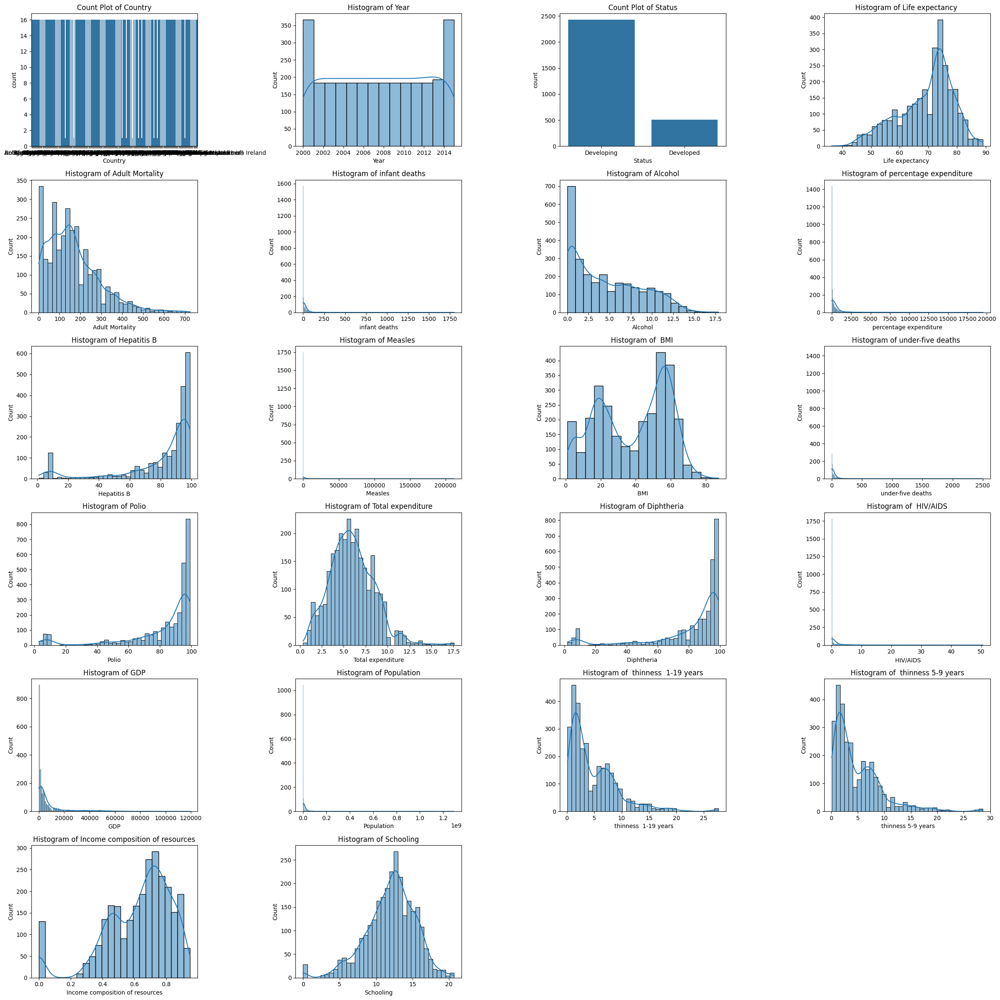

### Analisis missing value

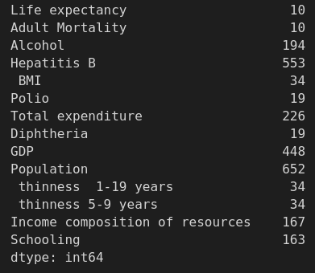

Fitur yang memiliki missing value memiliki jumlah yang beragam, dari 10 hingga 652 baris.

### Analisis duplicated data

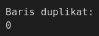

Tidak ada data duplikat

###  Analisis outlier fitur
Hampir seluruh fitur memilki outlier 

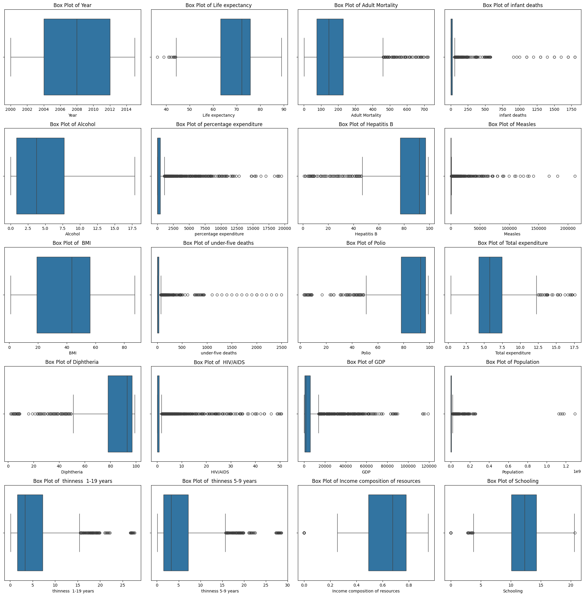

### Exploratory Data Analysis
Sebelum masuk pada tahap modeling, kita akan melakukan proses Exploratory Data Analysis terlebih dahulu untuk lebih memahami dataset yang dimiliki.
#### Persebaran data
Kita telah melakukan beberapa tahap transformasi, sehingga data yang kita miliki mulai mendekati bells curve. Berikut perbandingannya:

| Sebelum      | Sesudah|
|--------------|--------|
|| 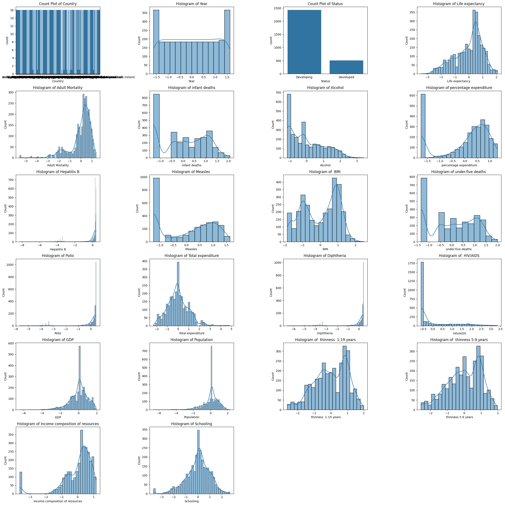|

#### Korelasi antar fitur
Grafik dibawah ini menggambarkan korelasi setiap fitur numerik

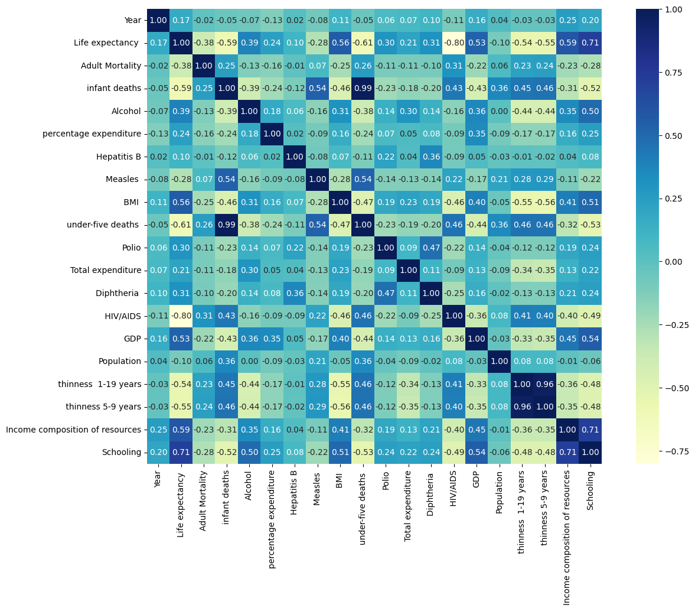

Berdasarkan bar plot dibawah ini, dapat dilihat 5 fitur yang paling berpengaruh dengan life expectancy adalah:
 - HIV/AIDS
 - Schooling
 - under-fixe deaths
 - Infant deaths
 - Income composition of resources
  
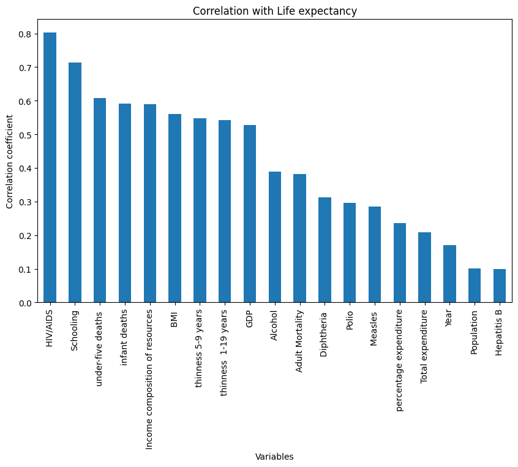

#### Histogram life expectancy

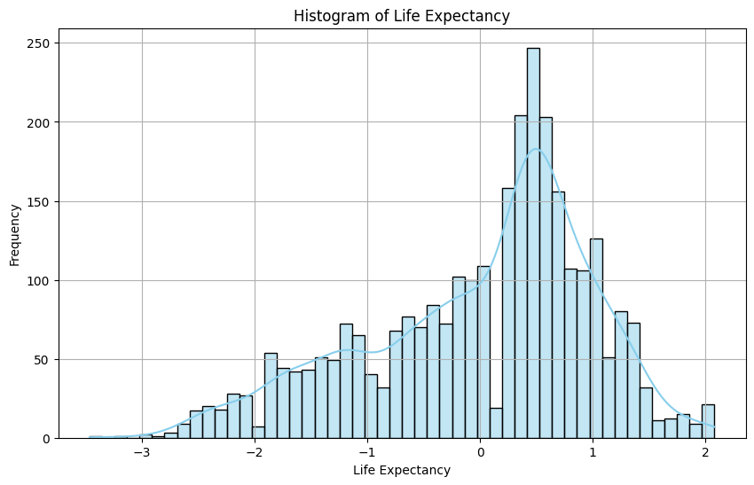

Histogram dari harapan hidup yang telah distandardisasi Sebagian besar nilai harapan hidup berada di sekitar rata-rata (nilai 0), dengan distribusi yang sedikit condong ke kiri (negatif), menunjukkan bahwa ada lebih banyak negara dengan harapan hidup di bawah rata-rata dibandingkan yang di atas. Pola ini mengindikasikan ketimpangan dalam distribusi harapan hidup antar negara secara global.

#### Life Expectancy based on Countries Status

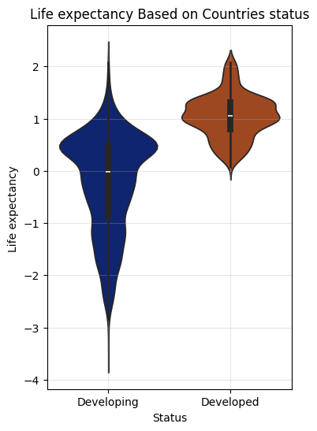

Violin plot diatas yang menunjukkan distribusi harapan hidup berdasarkan status negara, di mana status 0 dan 1 mewakili negara maju (developed) dan negara berkembang (developing). Terlihat bahwa negara dengan status 0 memiliki distribusi harapan hidup yang lebih tinggi dan merata dibandingkan status 1, yang memiliki sebaran lebih luas dan mencakup nilai harapan hidup yang sangat rendah. Artinya, negara dengan status 0 cenderung memiliki harapan hidup yang lebih baik secara konsisten.

#### Korelasi fitur categorical dengan Life Expectancy

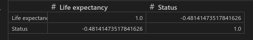

Fitur categorical yang kita gunakan adalah Status (Developed dan Developing)

## Data Preparation
Untuk dapat mengolah data, kita perlu mempersiapkannya terlebih dahulu. Langkah-langkah yang dilakukan untuk data preparation adalah:

### Cleaning missing value
Data kita memiliki skewness yang tinggi, karena itu kita menentukan treshold untuk membagi 2 fitur berdasarkan tingkat skew. Kali ini kita akan menggunakan abs(skewness) < 0.5

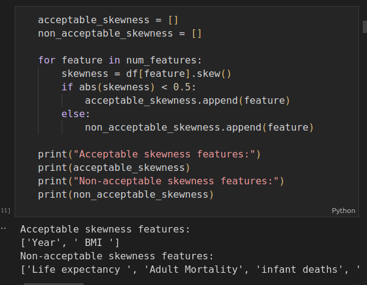

Missing value pada fitur dengan skewness yang tinggi akan diisi dengan nilai median, karena nilai median lebih robust terhadap skewed dan outlier. Sedangkan data lainnya akan diisi dengan nilai mean [Filling missing values with Mean and Median] 

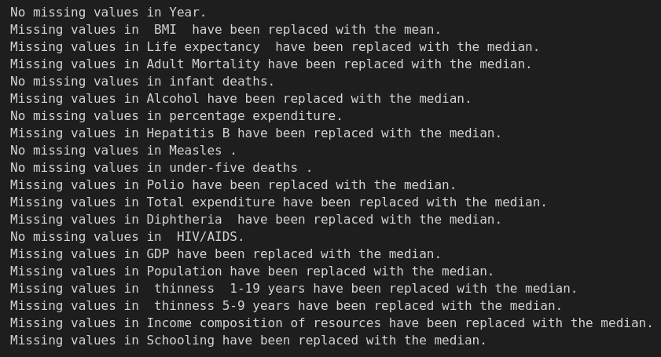

Missing value penting untuk ditangani, salah satunya untuk meningkatkan kualitas dataset [ML | Handling Missing Values].

### Drop fitur Country
Karena kita ingin menganalisis Life Expectancy secara global, maka data spesifik country tidak diperlukan, cukup status (developing/developed) dari country tersebut.

### Transformation
#### Log transformation

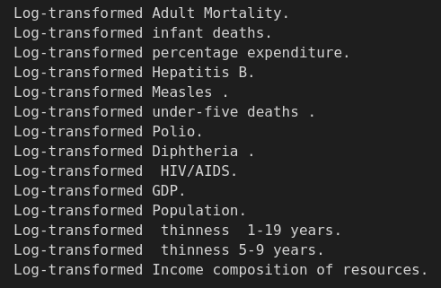

Seperti yang bisa dilihat pada grafik histogram sebelumnya, terdapat beberapa fitur yang memiliki skewness sangat tinggi. Karena itu kita menetapkan ambang batas abs(1) untuk dilakukan log transformation. Mengapa menggunakan log transformation? [Log Transformation: Purpose and Interpretation] dengan log transformation, kita bisa mengubah data kita menjadi "normal".

#### Standardization
Data kita memiliki banyak sekali outlier, karena itu kita menggunakan standardization [Normalization vs Standardization]. 

#### Label Encoding
Kita melakukan label ecoding untuk fitur kategorikal
```sh
from sklearn.preprocessing import LabelEncoder
df['Status'] = LabelEncoder().fit_transform(df['Status'])  # Developed = 0, Developing = 1
```

Kita perlu melakukan label encoding karena model tidak dapat memahami data kategorikal, kare itu kita perlu mentransformasikannya menjadi angka terlebih dahulu [Label Encoding in Python]. 


### Feature Selection
Sebelum membangun model, kita memilih fitur penting supaya model dapat berfokus pada fitur yang benar-benar berpengaruh [Why Feature Selection is Critical for Machine Learning].
Berikut ini cara melakukan feature selection dengan ambang batas abs(0.5)
```sh 
important_features = []

for feature in correlation_matrix.columns:
    if abs(correlation_matrix['Life expectancy '][feature]) > 0.5 and feature != 'Life expectancy ':
        important_features.append(feature)
        print(f"Feature '{feature}' has a strong correlation with 'Life expectancy ': {correlation_matrix['Life expectancy '][feature]}\n")
    else:
        print(f"Feature '{feature}' does not have a strong correlation with 'Life expectancy ': {correlation_matrix['Life expectancy '][feature]}\n")
```
### Data splitting
```sh
from sklearn.model_selection import train_test_split

X = df_important.drop(columns='Life expectancy ')
y = df_important['Life expectancy ']

X_train, X_test, y_train, y_test = train_test_split(X, y, test_size=0.2, random_state=42)
```
Pertama, kita perlu membagi dua dataset yang kita miliki menjadi data train dan data test.
Langkah-langkah untuk melakukan data splitting adalah:
 - Inisiasi variabel:
    - X : variabel-variabel fitur selain target
    - y : variabel target
 - Memanggil fungsi train test split, hasil data splitting akan disimpan pada variabel : X_train, X_test, y_train, y_test
 - Parameter yang digunakan yaitu:
   - X, y : data yang ingin dibagi
   - test_size : ukuran test size yang digunakan, pada kasus ini menggunakan 0.2 (80:20)
   - random_state=42 : memastikan konsistensi data yang dihasilkan meskipu proses data splitting dilakukan secara berulang.
Setelah melakukan data splitting, kemudian kita melakukan pengecekan jumlah data, seperti dibawah ini:

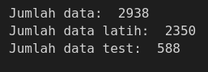


## Modeling
Setelah mempersiapkan dataset, kita dapat mulai membangun model. Ada beberapa tahapan yang perlu dilakukan, seperti yang akan dijelaskan dibawah ini.

### Model initialization
Langkah berikutnya adalah inisiasi model.
```sh
from sklearn.linear_model import LinearRegression, Ridge
from sklearn.linear_model import Lars
from sklearn.ensemble import GradientBoostingRegressor, RandomForestRegressor
from sklearn.metrics import mean_squared_error

models = {
    "Linear Regression": LinearRegression(),
    "LARS": Lars(),
    "Gradient Boosting": GradientBoostingRegressor(),
    "Random Forest": RandomForestRegressor(),
    "Ridge Regression": Ridge()
}
```
Untuk melakukan inisiasi model, tahapan yang dilakukan adalah:
- Import library yang akan digunaka
- Menginisiasi variabel model untuk menyimpan dictionary nama model dan pemanggilan model
  
Sedangkan untuk penjelasan model yang digunakan adalah:

| Nama Model    | Kelebihan & Kekurangan     | Referensi  |
|---------------|---------------|-------------|
| Linear Regression  | Linear Regression menawarkan kesederhanaan dan interpretabilitas tinggi, tetapi terbatas hanya untuk hubungan linier dan sensitif terhadap outlier. | [Linear Regression in Machine learning]|
| LARS    | Least Angle Regression (LARS) unggul dalam dataset berdimensi tinggi dan efektif untuk seleksi fitur, namun lebih kompleks untuk diinterpretasi dan kurang populer. | [Least Angle Regression (LARS)]|
|Gradient Boosting  | Gradient Boosting memberikan performa sangat tinggi untuk hubungan kompleks, tetapi membutuhkan tuning parameter yang ekstensif dan komputasi berat.  | [Gradient Boosting] |
| Random Forest | Random Forest menawarkan keseimbangan yang baik dengan performa solid tanpa banyak penyesuaian dan ketahanan terhadap overfitting, meskipun kurang interpretable. | [Random Forest Algorithm in Machine Learning] |
| Ridge Regression  | Ridge Regression efektif mengatasi multikolinearitas melalui regularisasi L2, tetapi tidak melakukan seleksi fitur dan masih terbatas pada hubungan linier. | [Ridge Regression] |

Setelah mengetahui karakteristik model, kita perlu mengetahui cara kerja beserta tahapan penyusunan model-model tersebut. Semua model machine learning dalam proyek ini mengikuti **tahap penyusunan** yang sama, yaitu:
1. Pengumpulan dan preprocessing data
2. Memisahkan fitur (X) dan target (y)
3. Membagi data menjadi training dan testing
4. Inisialisasi model
5. Melatih model dengan metode fit()
6. Memprediksi nilai target pada data testing
7. Mengevaluasi model dengan metrik MSE, RMSE, dan R²

Yang membedakan masing-masing model adalah cara kerja algoritma di dalamnya, terutama pada saat proses pelatihan (fit) dan bagaimana model mempelajari pola dari data. 

Sedangkan untuk **cara kerja dari model**, dapat dilihat pada tabel berikut:

| Model | Cara Kerja | Referensi |
|-------|------------| -------|
| Linear Regression | Mencari hubungan linear antara variabel independen (fitur) dan variabel dependen (target) dengan meminimalkan jumlah kuadrat dari selisih antara nilai aktual dan prediksi (residual). | [Linear Regression in Machine learning] |
| LARS (Least Angle Regression) | Menggabungkan konsep forward selection dan regularisasi. Dimulai dari koefisien nol dan secara bertahap meningkatkan koefisien dalam arah yang memiliki korelasi tertinggi dengan residual saat ini. Algoritma secara iteratif memilih fitur yang paling berkorelasi dengan residual dan memperbarui koefisien secara bertahap hingga semua fitur terpilih atau kriteria berhenti tercapai. | [Least Angle Regression (LARS)] |
| Gradient Boosting Regressor | Membangun model secara sekuensial (biasanya decision tree), di mana setiap model baru mencoba memperbaiki kesalahan model sebelumnya. Mengoptimalkan fungsi loss dengan mengikuti arah gradien negatif. Proses dimulai dengan prediksi konstan, kemudian secara iteratif menghitung residual dari model saat ini, melatih weak learner baru untuk memprediksi residual tersebut, dan menambahkannya ke model dengan bobot tertentu (learning rate). Model final adalah kombinasi dari semua weak learner. | [Gradient Boosting] |
| Random Forest Regressor | Metode ensemble yang terdiri dari banyak decision tree. Setiap tree dilatih pada subset acak dari data pelatihan (bootstrap sampling) dan menggunakan subset acak dari fitur. Pada setiap node, algoritma memilih subset acak dari fitur untuk mencari split terbaik dan memperluas tree hingga kriteria berhenti tercapai. Prediksi akhir adalah rata-rata dari prediksi semua tree. | [Random Forest Algorithm in Machine Learning] |
| Ridge Regression | Variasi dari Linear Regression yang menambahkan regularisasi L2. Meminimalkan jumlah kuadrat residual plus nilai alpha dikali jumlah kuadrat koefisien untuk mengurangi overfitting dan menangani multikolinearitas. Model mencari koefisien yang meminimalkan formula: RSS (Residual Sum of Squares) + alpha * (koefisien²). | [Ridge Regression] |

Untuk parameter yang digunakan, saya menggunakan parameter default dalam proses inisiasi. Untuk mengetahui parameter default tiap model, dapat dilakukan dengan klik Ctrl dan klik kursos pada fungsi pemanggilan model. Nanti kita akan diarahkan pada source code, dan disana akan terdapat informasi seputar default value. 

Adapun **parameter default** dari setiap model yang dipakai adalah:

**Linear Regression**
| Parameter | Nilai Default | Keterangan |
|-----------|---------------|------------|
| fit_intercept | True | Menghitung nilai intercept dalam model |
| copy_X | True | Membuat salinan data X |
| n_jobs | None | Menggunakan 1 prosesor untuk komputasi |
| positive | False | Tidak membatasi koefisien untuk positif |

**LARS (Least Angle Regression)**
| Parameter | Nilai Default | Keterangan |
|-----------|---------------|------------|
| fit_intercept | True | Menghitung nilai intercept dalam model |
| verbose | False | Tidak menampilkan output tambahan saat fitting |
| normalize | True (deprecated) | Akan dihapus di versi mendatang |
| precompute | 'auto' | Menentukan otomatis apakah precompute bermanfaat |
| n_nonzero_coefs | 500 | Jumlah maksimum koefisien non-zero |
| eps | 2.22e-16 | Presisi mesin untuk stopping condition |
| copy_X | True | Membuat salinan data X |

**Gradient Boosting Regressor**
| Parameter | Nilai Default | Keterangan |
|-----------|---------------|------------|
| loss | 'squared_error' | Fungsi loss yang dioptimalkan |
| learning_rate | 0.1 | Tingkat pembelajaran untuk kontribusi setiap tree |
| n_estimators | 100 | Jumlah boosting stages (trees) |
| subsample | 1.0 | Fraksi sampel untuk fitting setiap tree |
| criterion | 'friedman_mse' | Fungsi untuk mengukur kualitas split |
| min_samples_split | 2 | Jumlah minimal sampel untuk internal node split |
| min_samples_leaf | 1 | Jumlah minimal sampel untuk leaf node |
| min_weight_fraction_leaf | 0.0 | Fraksi bobot minimal di leaf node |
| max_depth | 3 | Kedalaman maksimum setiap tree |
| min_impurity_decrease | 0.0 | Threshold untuk node split |
| max_features | None | Jumlah fitur untuk mencari split terbaik |
| alpha | 0.9 | Parameter untuk quantile loss dan huber loss |
| max_leaf_nodes | None | Jumlah maksimum leaf nodes |
| warm_start | False | Tidak menggunakan solusi sebelumnya |
| validation_fraction | 0.1 | Fraksi data training untuk validasi |
| n_iter_no_change | None | Iterasi tanpa peningkatan untuk early stopping |
| tol | 0.0001 | Toleransi untuk early stopping |
| ccp_alpha | 0.0 | Parameter kompleksitas untuk pruning |

**Random Forest Regressor**
| Parameter | Nilai Default | Keterangan |
|-----------|---------------|------------|
| n_estimators | 100 | Jumlah trees dalam forest |
| criterion | 'squared_error' | Fungsi untuk mengukur kualitas split |
| max_depth | None | Kedalaman maksimum tree (None = expand sampai leaf murni) |
| min_samples_split | 2 | Jumlah minimal sampel untuk internal node split |
| min_samples_leaf | 1 | Jumlah minimal sampel untuk leaf node |
| min_weight_fraction_leaf | 0.0 | Fraksi bobot minimal di leaf node |
| max_features | 1.0 atau 'auto' | Jumlah fitur untuk mencari split terbaik |
| max_leaf_nodes | None | Jumlah maksimum leaf nodes |
| min_impurity_decrease | 0.0 | Threshold untuk node split |
| bootstrap | True | Menggunakan bootstrap samples |
| oob_score | False | Tidak menggunakan out-of-bag samples untuk estimasi |
| n_jobs | None | Jumlah jobs untuk fitting dan prediksi (None = 1) |
| random_state | None | Seed untuk random number generator |
| verbose | 0 | Kontrol verbosity output |
| warm_start | False | Tidak menggunakan solusi sebelumnya |
| ccp_alpha | 0.0 | Parameter kompleksitas untuk pruning |

**Ridge Regression**
| Parameter | Nilai Default | Keterangan |
|-----------|---------------|------------|
| alpha | 1.0 | Konstanta regularisasi yang menentukan kekuatan regularisasi |
| fit_intercept | True | Menghitung nilai intercept dalam model |
| normalize | False (deprecated) | Akan dihapus di versi mendatang |
| copy_X | True | Membuat salinan data X |
| max_iter | None | Jumlah maksimum iterasi untuk solver |
| tol | 0.001 | Toleransi untuk solusi |
| solver | 'auto' | Solver komputasi yang digunakan |
| positive | False | Koefisien tidak dibatasi positif |
| random_state | None | Seed untuk random number generator |

Meskipun kita telah mengetahui karakteristik dari masing-masing algoritma, kita perlu mengujinya terlebih dahulu, karena dataset itu unik, sehingga tidak ada algoritma yang sejatinya langsung sesuai dengan algoritma tertentu. Untuk itu, kita akan melakukan pelatihan dan evaluasi untuk memilih algoritma.


## Evaluation

Untuk melakukan tahap evaluasi, berikut ini langkah-langkah yang dapat dijalankan:
### Membuat dataframe 
EvaluasiDataframe mencakup nama model, serta metrik yang digunakan. Pada kasus ini, kita menggunakan metrik MSE, RMSE, R2.
```sh
df_results = pd.DataFhttps://learn.saylor.org/mod/page/view.php?id=80811rame(columns=["Model", "MSE", "RMSE", "R2"])
```

Dilansir dari [Metrics for Linear Regression Effectiveness: R-squared, MSE and RSE] penjelasan dari masing-masing metrik adalah sebagai berikut:

| Metrik  | Deskripsi       | Cara kerja      | Formula |
|---------|-----------------|-----------------|--------|
| Mean Squared Error (MSE)  | MSE adalah metrik yang mengukur rata-rata kuadrat dari error (selisih antara nilai prediksi dan nilai aktual). Semakin kecil nilai MSE, semakin baik model prediksi.  | MSE bekerja dengan menghitung selisih antara nilai prediksi dan nilai aktual, mengkuadratkan selisih tersebut (untuk menghilangkan nilai negatif), kemudian menghitung nilai rata-ratanya. Pengkuadratan membuat MSE lebih sensitif terhadap outlier. | $MSE = \frac{1}{n} \sum_{i=1}^{n} (y_i - \hat{y}_i)^2$|
| Root Mean Squared Error (RMSE)  | RMSE adalah akar kuadrat dari MSE, digunakan untuk mendapatkan error dalam unit yang sama dengan variabel yang diprediksi. RMSE lebih mudah diinterpretasi karena berada dalam skala data asli. | RMSE bekerja dengan menghitung MSE terlebih dahulu, kemudian mengambil akar kuadratnya. Seperti MSE, RMSE juga sensitif terhadap outlier dan nilai yang lebih besar memberikan penalti yang lebih besar.  | $RMSE = \sqrt{\frac{1}{n} \sum_{i=1}^{n} (y_i - \hat{y}_i)^2}$ |
|Coefficient of Determination (R²)  | R² mengukur proporsi variasi dalam variabel dependen yang dapat dijelaskan oleh variabel independen dalam model. Nilainya berkisar antara 0 hingga 1, dimana nilai yang lebih tinggi menunjukkan model yang lebih baik. | R² bekerja dengan membandingkan error model dengan variasi total data. R² mengukur seberapa baik model menangkap pola dalam data dibandingkan dengan hanya menggunakan nilai rata-rata sebagai prediksi.  | $R^2 = 1 - \frac{SS_{res}}{SS_{tot}} = 1 - \frac{\sum_{i=1}^{n} (y_i - \hat{y}_i)^2}{\sum_{i=1}^{n} (y_i - \bar{y})^2}$

### Training dan Evaluasi model
Setelah menyiapkan dataframe dan metrik evaluasi, selanjutkan lakukan traininng dan evaluasi pada model yang telah dilakukan inisiasi.
```sh
results = []

for model_name, model in models.items():
    model.fit(X_train, y_train)
    y_pred = model.predict(X_test)
    
    mse = mean_squared_error(y_test, y_pred)
    rmse = mse ** 0.5
    r2 = model.score(X_test, y_test)
    
    results.append({
        "Model": model_name,
        "MSE": mse,
        "RMSE": rmse,
        "R2": r2
    })

df_results = pd.DataFrame(results)
```
### Analisis hasil evaluasi

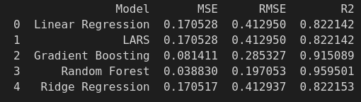

Dari hasil evaluasi tersebut, algoritma menunjukkan keunggulan dengan MSE dan RMSE terendah, serta R2 tertinggi. Sehingga algoritma yang dipilih adalah **random forest.**

### Visualisasi prediksi model

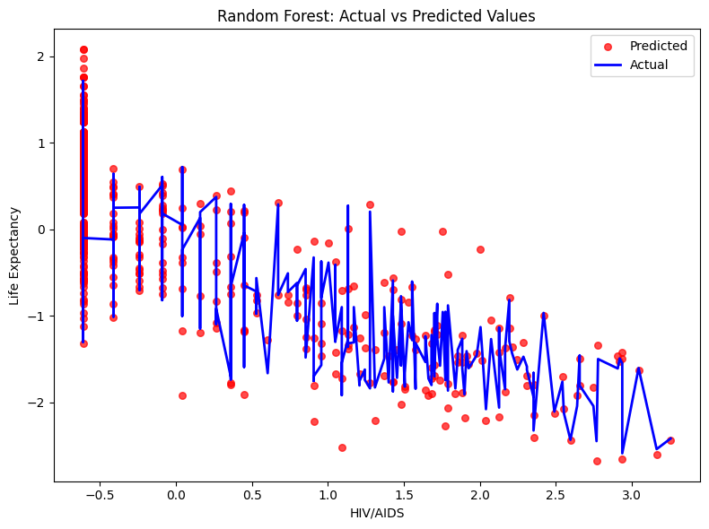

Algoritma random forest telah melakukan prediksi dengan baik.

### Hyperparameter tuning
Meskipun hasil telah memuaskan, kita belum melakukan tuning apapun terhadap model kita. Karena itu, kita dapat melakukan penyesuaian model melalui hyperparameter tuning.Metode yang digunakan adalah Bayesian search optimization. 

Diambil dari [Bayesian Optimization in Machine Learning], Bayesian Optimization adalah strategi optimasi yang memanfaatkan prinsip-prinsip inferensi Bayesian untuk menemukan minimum (atau maksimum) dari sebuah fungsi objektif secara efisien. Teknik ini sangat efektif untuk mengoptimalkan fungsi yang kompleks, mahal secara komputasi, atau bersifat black-box seperti hyperparameter tuning pada model machine learning.

**Metode ini bekerja dengan dua komponen utama:**

1. **Surrogate Model**: Model probabilistik (umumnya Gaussian Process) yang mengaproksimasi fungsi objektif
2. **Acquisition Function**: Fungsi utilitas yang memandu pemilihan titik berikutnya untuk dievaluasi berdasarkan model surrogate

**Cara Kerja Bayesian Optimization:**

1. **Inisialisasi**: Proses dimulai dengan sampling fungsi objektif pada beberapa titik awal.
2. **Membangun Surrogate Model**: Gaussian Process (GP) biasanya digunakan sebagai model surrogate. GP dipilih karena kemampuannya memberikan prediksi mean dan ukuran ketidakpastian (variance) pada setiap titik di ruang input. 
GP didefinisikan dengan:

      $f(x) ~ GP(m(x), k(x,x'))$

      Di mana m(x) adalah fungsi mean dan k(x,x') adalah fungsi kernel yang mendefinisikan kovarians.

3.  **Maksimisasi Acquisition Function**: Titik sampling berikutnya dipilih dengan memaksimalkan acquisition function yang menyeimbangkan eksplorasi dan eksploitasi. Beberapa acquisition function yang umum:
    - Expected Improvement (EI):
          
        $EI(x) = E[max(f(x) - f(x+), 0)]$

        Di mana f(x+) adalah nilai terbaik yang diamati saat ini.

    - Upper Confidence Bound (UCB):
  
        $UCB(x) = μ(x) + κσ(x)$

        Di mana μ(x) dan σ(x) adalah mean dan standar deviasi dari prediksi GP, dan κ adalah parameter yang menyeimbangkan eksplorasi dan eksploitasi.


1. **Evaluasi Fungsi Objektif**: Titik yang dipilih dievaluasi untuk mendapatkan f(x) dan data baru ini ditambahkan ke dataset yang digunakan untuk memperbarui model GP.
2. **Iterasi**: Langkah-langkah memperbarui acquisition function, memilih titik baru, dan memperbarui model surrogate diulang. Dengan setiap iterasi, model surrogate menjadi semakin akurat, dan pencarian secara progresif mengarah ke optimum.

**Keuntungan Bayesian Optimization:**

- Efisiensi: Sangat efisien dalam menemukan optimum dengan jumlah evaluasi minimal, cocok untuk fungsi objektif yang mahal atau memakan waktu.
- Fleksibilitas: Dapat diterapkan pada berbagai masalah optimasi, termasuk fungsi bising, diskontinu, dan non-konveks.
- Kuantifikasi Ketidakpastian: Sifat probabilistik dari model surrogate memungkinkan kuantifikasi ketidakpastian, memberikan wawasan tentang keandalan prediksi.

Dalam implementasi kita, Bayesian Optimization dilakukan menggunakan BayesSearchCV dari library scikit-optimize dengan ruang pencarian parameter sebagai berikut:

```sh
search_space = {
    'n_estimators': Integer(50, 300),
    'max_depth': Integer(5, 30),
    'min_samples_split': Integer(2, 20),
    'min_samples_leaf': Integer(1, 10),
    'max_features': Categorical(['sqrt', 'log2', None]),
    'bootstrap': Categorical([True, False])
}
```

Berdasarkan optimasi tersebut, hyperparameter terbaik yang ditemukan adalah:

- n_estimators: 77
- max_depth: 20
- min_samples_split: 2
- min_samples_leaf: 1
- max_features: 'sqrt'
- bootstrap: False

Hasil hyperparameter ini memberikan peningkatan performa yang signifikan dengan mengurangi MSE sebesar 24.27% (dari 0.038830 menjadi 0.029405), mengurangi RMSE sebesar 12.98% (dari 0.197053 menjadi 0.171480), dan meningkatkan R² sebesar 1.02% (dari 0.959501 menjadi 0.969331).

### Visualisasi Hyperparameter tuning
Berikut ini visualisasi prediksi dengan tuned model. 

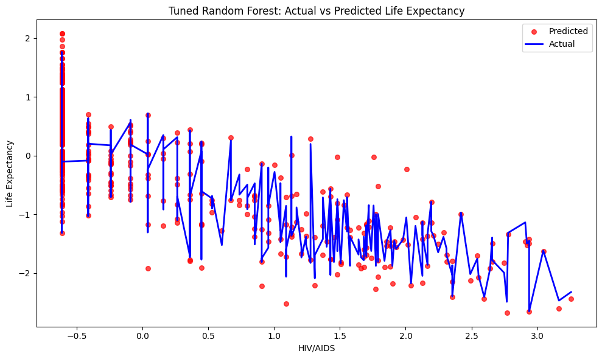

### Evaluasi tuned model
Berikut ini evaluasi tuned model dengan model awal
```sh
Random Forest Model Comparison:
                      Model      MSE     RMSE       R2
0  Random Forest (Original) 0.038830 0.197053 0.959501
1     Random Forest (Tuned) 0.029405 0.171480 0.969331


Improvement Metrics:
MSE: Reduced by 24.27%
RMSE: Reduced by 12.98%
R2: Increased by 1.02%

Optimal Hyperparameters:
n_estimators: 77
max_depth: 20
min_samples_split: 2
min_samples_leaf: 1
max_features: 'sqrt'
bootstrap: False
```
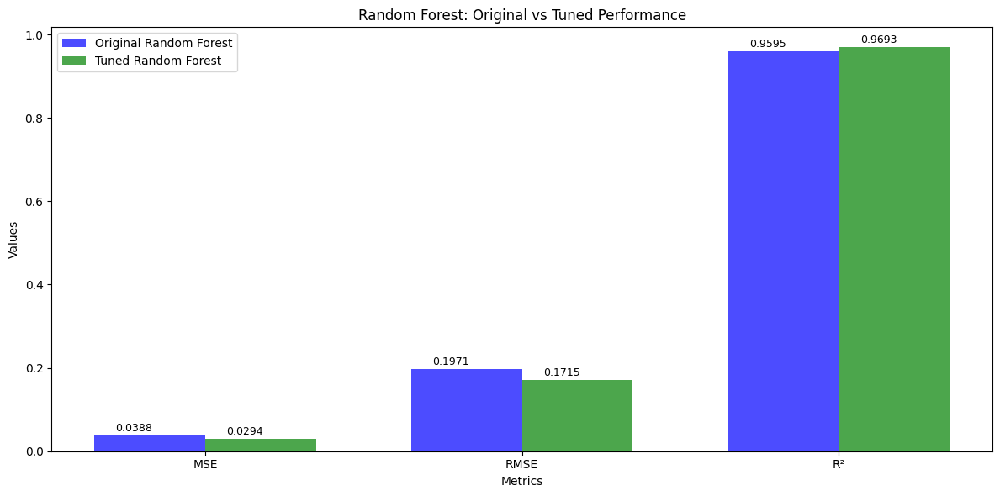

Tuned model berhasil menurunkan MSE dan RMSE, serta meningkatkan R2.


[//]:#

[Sejawat]: <https://sejawat.co.id/article/detail/life-expectancy-memperpanjang-harapan-rentang-hidup-1680701940>

[Erupean Commission]: <https://ec.europa.eu/eurostat/statistics-explained/index.php?title=Glossary:Life_expectancy>

[Determinants in Predicting Life Expectancy Using Machine Learning]: <https://doi.org/10.23947/2687-1653-2022-22-4-373-383>

[Life Expectancy (WHO)]: <https://www.kaggle.com/datasets/kumarajarshi/life-expectancy-who>

[Filling missing values with Mean and Median]: <https://tahera-firdose.medium.com/filling-missing-values-with-mean-and-median-76635d55c1bc>

[When should I remove an outlier from my dataset?]: <https://www.scribbr.com/frequently-asked-questions/when-to-remove-an-outlier/>

[Log Transformation: Purpose and Interpretation]: <https://medium.com/@kyawsawhtoon/log-transformation-purpose-and-interpretation-9444b4b049c9>

[Normalization vs Standardization]: <https://www.geeksforgeeks.org/normalization-vs-standardization/>

[Why Feature Selection is Critical for Machine Learning]: <https://ujangriswanto08.medium.com/why-feature-selection-is-critical-for-machine-learning-3913fffd62c0>

[ML | Handling Missing Values]: <https://www.geeksforgeeks.org/ml-handling-missing-values/>

[Label Encoding in Python]: <https://www.geeksforgeeks.org/ml-label-encoding-of-datasets-in-python/>

[Linear Regression in Machine learning]: <https://www.geeksforgeeks.org/ml-linear-regression/>

[Least Angle Regression (LARS)]: <https://www.geeksforgeeks.org/least-angle-regression-lars/>

[Gradient Boosting]: <https://www.geeksforgeeks.org/ml-gradient-boosting/>

[Random Forest Algorithm in Machine Learning]: <https://www.geeksforgeeks.org/random-forest-algorithm-in-machine-learning/>

[Ridge Regression]: <https://www.geeksforgeeks.org/what-is-ridge-regression/>

[Metrics for Linear Regression Effectiveness: R-squared, MSE and RSE]: <https://learn.saylor.org/mod/page/view.php?id=80811>

[Bayesian Optimization in Machine Learning]: <https://www.geeksforgeeks.org/bayesian-optimization-in-machine-learning/>